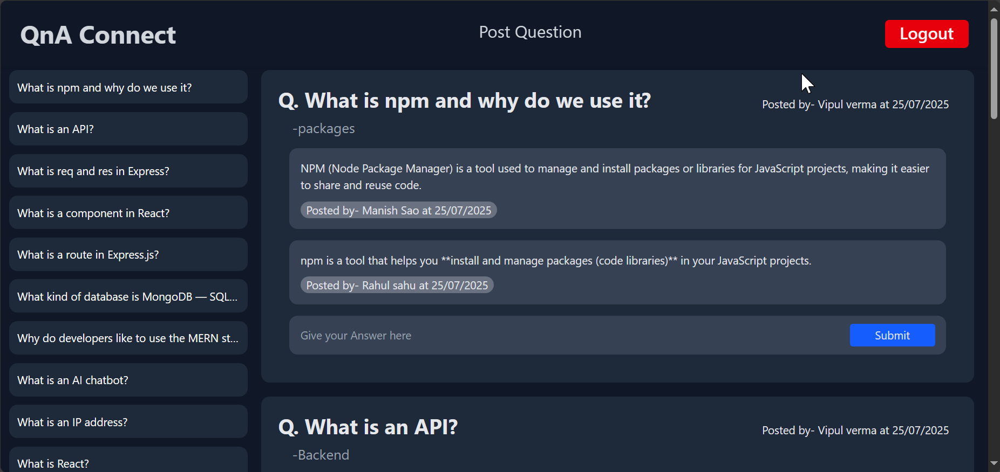

# QnA Connect

**QnA Connect** is a full-stack MERN (MongoDB, Express.js, React, Node.js) application that offers users a secure platform to ask questions and share answers. User data is protected and accessible only to authorized users. Users can register, log in, and engage in discussions, fostering a collaborative environment for knowledge sharing.

---

##  Features

- Users can register and log in to their accounts.
- Personal dashboard for authorized users to add, edit, and delete their questions.
- Common dashboard displaying all questions and answers, accessible to everyone.
- Only authorized users can ask questions and provide answers.
- Fast UI built with Tailwind CSS and Vite.
- RESTful API using Express and MongoDB.
- Users can engage in discussions and share knowledge.

##  Tech Stack

###Frontend

- **React** 
- **React Router DOM** 
- **Tailwind CSS**
- **Vite** 
- **Axios** 
- **react-icons** 
- **react-toastify** 

###  Backend

- **Node.js**
- **Express** 
- **MongoDB** + **Mongoose** 
- **dotenv** 
- **cors** 
- **nodemon**
- **bcryptjs**
- **cookie-parser**
- **jsonwebtoken**

---
##  Screenshots

### User registration

### User Login

### User personal dashboard

### Common dashboard

